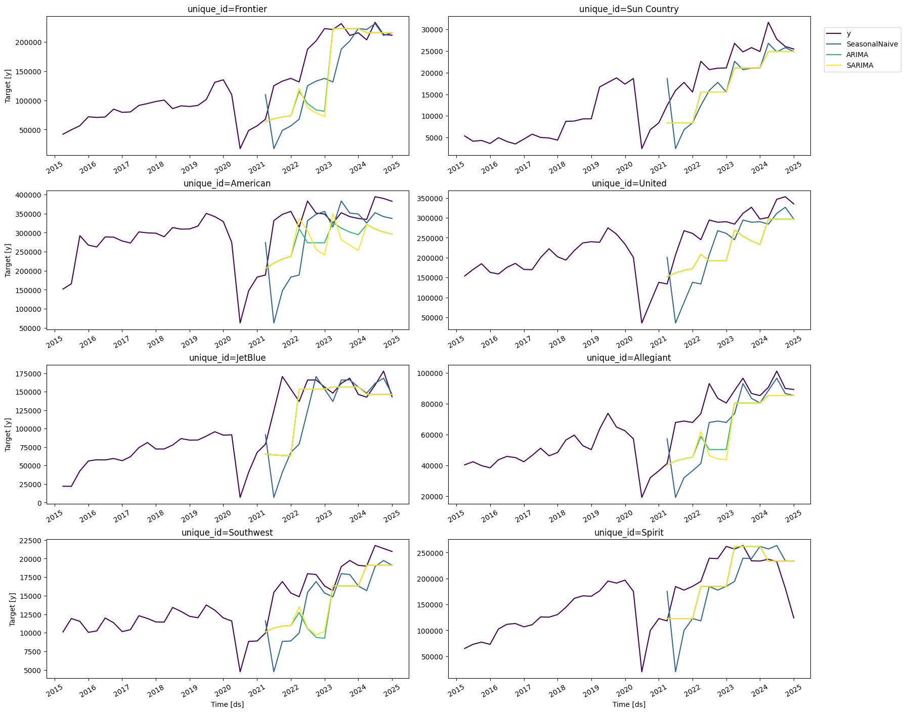

# Baggage Revenue Model

Predicting the Baggage Revenue of Southwest Airlines.

## Description

The objective of this project is forecasting quarterly baggage revenue of Southwest Airlines using BTS data from the last 10 years. Various models such as - Naive Seasonal, ARIMA, SARIMA have been trained on the data to capture trends in the data.

## Getting Started

### Dependencies

* Python 3.10.19
* miniconda

### Setup

1. git clone https://github.com/PranavShidlaghatta/BaggageRevenueModel.git

2. cd BaggageRevenueModel

3. conda create --name "your-env" python==3.10.19

4. pip install -r requirements.txt

### Executing program

1. Create a data folder and add combined_bag_revenue.csv to it.

2. Open bag_rev_eda.ipynb and run all cells to perform eda on the BTS data:

You will be able to analyze the baggage revenue by quarter only for Soutwest Airlines in this plot:

  

This plot shows the baggage revenue by quarter of all major airlines over the last 10 years:

  

To take a closer look at the data, we can decompose the data into trend and seasonality.

  

Conclusions from EDA: 
- There is a clear seasonal pattern in the data.
- There is a significant dip in the baggage revenue by quarter during the COVID years.
- The data has non-constant variance

3. Open bag_rev_forecast.ipynb and run all cells.

  

Current state of the Models and Takeaways:
The curves of all three models relatively follow the same pattern as the actual baggage revenues. However, the parameters such as window size need to be adjusted to enhance the predictions. We also need to account for exogenous factors (such as COVID). Apply log transform or Box-Cox transform to mitigate the impact of the huge dip. This would reduce the heteroscedasticity, allowing models like ARIMA and SARIMA to perform better.

## Authors

**Pranav Shidlaghatta**

Github: https://github.com/PranavShidlaghatta

Linkedin: https://www.linkedin.com/in/pranav-shidlaghatta

**Rayan Mohammed**

Github: https://github.com/pixelated-explorer

LinkedIn: https://www.linkedin.com/in/rayan-mohammed-5a55bb255/

## Version History

TODO

## License

TBD

## Acknowledgments

* [Bureau of Transportation Statistics](https://www.transtats.bts.gov/)
* [StatsForecast Library](https://github.com/Nixtla/statsforecast)